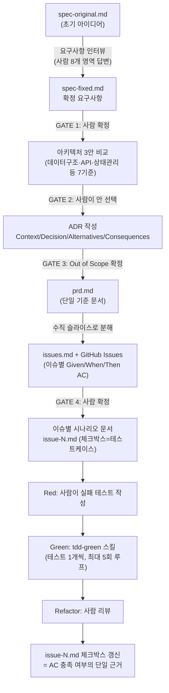

# AI 코딩 도구를 실무 개발 프로세스로 체계화하기

> 대상 프로젝트: [jp-study](http://8.230.13.114) (PDF 단어장 업로드 → AI 구조화 → 4지선다 퀴즈 + SRS 복습, 1인 개인용 웹앱)
> 기간: 2026-07-05 ~ 2026-07-06(MVP 14개 이슈) + 2026-07-15(배포 구성 추가)

---

## 1. 한 줄 요약

**"기획서 → 이슈 → 테스트 → 구현"** 전 과정을 사람이 판단 지점(승인 게이트)을 쥔 채로 재사용 가능한 스킬(Claude Code Skill) 2종으로 자산화했고, 그 파이프라인으로 14개 이슈·164개 테스트·전 케이스 AC 통과 상태의 MVP를 이틀 만에 완성한 뒤, 동일 파이프라인을 두 번째 기능(user-roles)에 재적용해 이식성을 검증했다.

---

## 2. 문제 정의 — AI 코딩 도구 도입 전 병목

개인 프로젝트라도 "AI에게 대충 시키기"로는 아래 세 가지 문제가 반복적으로 발생했다.

- **문서-구현 불일치**: 요구사항을 대화로만 전달하면 AI가 매번 다르게 해석하고, 나중에 "왜 이렇게 만들었는지"를 문서로 추적할 수 없다.
- **테스트 누락**: AI에게 "구현해줘"라고만 하면 테스트 없이 동작만 만들고 끝나는 경우가 많아, 회귀를 잡을 안전망이 없다.
- **컨텍스트 재설명 비용**: 매 세션마다 프로젝트 배경·기술 스택·이전 결정을 다시 설명해야 해서, 이슈 하나를 시작할 때마다 워밍업 비용이 든다.
- **판단 위임의 불투명성**: "AI가 알아서 잘 짰겠지"로 넘어가면, 어떤 결정을 내가 검증했고 어떤 걸 AI에게 맡겼는지가 코드에 남지 않는다.

이 문제들을 해결하려면 AI를 "코드를 대신 쳐주는 도구"가 아니라 **정해진 절차를 따르는 프로세스의 실행자**로 다뤄야 한다는 결론에 도달했다.

---

## 3. 해결 접근

### 3-1. 워크플로를 스킬로 자산화

Claude Code의 Skill 기능으로 두 개의 절차를 코드화했다.

| 스킬              | 역할                      | 핵심 장치                                                    |
| ----------------- | ------------------------- | ------------------------------------------------------------ |
| `feature-planner` | 아이디어 → 이슈 단위 기획 | 4개의 **승인 게이트**(요구사항 확정 / 아키텍처 3안 비교 / Out of Scope / 이슈 목록)에서 반드시 사람 확정을 기다림 |
| `tdd-green`       | 실패 테스트 → 최소 구현   | 테스트 1개씩 겨냥, 5회 수정 실패 시 임의 반복 대신 **보고 후 중단**, 커버리지는 참고 지표로만 사용(커버리지를 올리기 위한 테스트 추가 금지) |

두 스킬 모두 이번 프로젝트 전용 스크립트가 아니라 `docs/features/{name}/` 규칙만 지키면 어떤 기능에도 재적용되도록 설계했다. 실제로 2번째 기능(user-roles)에 그대로 재사용했다(§7).

### 3-2. 파이프라인: PRD → 이슈 분해 → TDD → AC 검증



핵심은 **AC(Given/When/Then)가 이슈 문서의 체크박스를 거쳐 테스트 케이스로 그대로 이어진다는 점**이다. `tdd-green`은 vitest가 보고하는 테스트 수와 시나리오 문서의 체크박스 수를 대조해, import 누락으로 테스트가 통째로 collect 실패하는 상황(실제로는 통과하지 않았는데 "적게 실패"로 보이는 함정)까지 자동으로 탐지하도록 설계했다.

### 3-3. 사람 판단 vs AI 위임의 경계

| 단계             | 사람이 판단                                                  | AI(Claude Code)에 위임                        |
| ---------------- | ------------------------------------------------------------ | --------------------------------------------- |
| 요구사항 확정    | 8개 질문 영역에 실제 답변, 경계조건·에러처리 확정 (예: "복습 우선 방식에서 대상 0개면 어떤 문구를 보여줄지") | 질문 초안 생성, 답변을 spec-fixed.md로 구조화 |
| 아키텍처 선택    | 3안 비교표에서 최종안 승인(예: 서버 잡+폴링 vs 클라 오케스트레이션 vs 큐/워커 — ADR-1) | 3안 도출, 트레이드오프표 작성                 |
| 테스트 설계(Red) | 어떤 케이스를 테스트할지, AC를 어떤 단위 테스트로 쪼갤지 결정 | — (Red는 사람 영역으로 남김)                  |
| 구현(Green)      | 5회 실패 시 원인 판단, 근본 수정 여부 결정(§6 시행착오 참고) | 테스트를 통과시키는 최소 코드 작성            |
| 리팩터/커밋      | 커밋 단위·메시지·머지 여부                                   | 리팩터 후보 제시                              |

---

## 4. 기술적 의사결정 — 설계 근거

### 4-1. AI 잡 실행 아키텍처 (ADR-1)

PDF 파싱(Pass 1)·유의어/예문 생성(Pass 2)은 수십 회의 Gemini 청크 호출이 필요한 장시간 작업이다. 클라이언트 오케스트레이션(새로고침 시 진행 상태 유실), 큐/워커 분리(Redis·워커 인프라, 1인 로컬 앱엔 과함) 두 대안을 각각 이유를 들어 기각하고, **서버가 잡을 소유하고 클라이언트는 폴링만 하는 구조**를 선택했다(`docs/prd.md` ADR-1).

이 구조를 지탱하는 것은 청크 처리를 **순수 함수**로, 재시도·백오프·진행률 집계를 **제네릭 러너**(`lib/jobRunner.ts`)로 분리한 설계다.

```ts
// lib/jobRunner.ts — 발췌
export async function runWithRetry<C, T>(
  chunks: C[],
  process: (chunk: C) => Promise<T[]>,
  opts: { maxRetries?: number; minCallIntervalMs?: number; ... } = {},
): Promise<{ results: T[]; failedChunks: number; lastError?: string }>
```

이 분리는 처음부터 설계 의도로 넣은 것이 아니라, 실제 장애(Gemini 무료 티어 429 rate limit)를 겪은 뒤 내가 재시도 정책을 다시 설계해서 넣은 결과다.

- 실패는 **해당 청크만** 재시도(전체 재실행 금지) — 비용·시간 낭비 방지가 목적.
- 429 응답의 `retry in Ns` 힌트를 파싱해 대기 시간을 계산하고(`retryDelayMs`), 힌트가 없으면 20초 고정 대기.
- 호출 간 최소 간격(`minCallIntervalMs`)을 둬 분당 호출 한도 자체를 넘지 않게 함.
- 청크 3회 초과 실패 시 그 청크만 실패로 표시하고 나머지는 계속 진행 — 부분 실패를 전체 실패로 만들지 않음.

이 정책들은 AI가 제안한 초안을 그대로 채택한 게 아니라, 실제 429 로그를 보고 "왜 실패하는지 → 얼마나 기다려야 하는지 → 실패 단위를 얼마나 좁힐지"를 내가 판단해 `jobRunner.test.ts`로 검증한 뒤 확정한 것이다.

### 4-2. 도메인 로직과 저장/UI의 분리 (SRS·퀴즈 출제)

`lib/srs.ts`의 `applyAnswer`(레벨·복습일 갱신)와 `selectSessionWords`(출제 대상 선정, 4가지 모드)는 Prisma·React에 전혀 의존하지 않는 순수 함수다. Leitner 간격표(`[0,1,3,7,14,30]`)와 "오답 시 레벨 0으로 즉시 재출제" 같은 도메인 규칙이 DB 스키마나 컴포넌트 코드에 흩어지지 않고 한 파일에 응집되어 있다.

이 분리 덕분에 "복습 우선 모드에서 대상이 0개면 어떤 문구를 보여줄지" 같은 경계조건(§3-3)을 DB나 UI를 띄우지 않고 순수 함수 단위 테스트만으로 검증할 수 있었고(`srs.test.ts`), 이후 퀴즈 유형이 2종 → 3종, 출제 방식이 1종 → 4종으로 확장될 때도(#11) UI·API 코드는 거의 건드리지 않고 `lib/srs.ts`, `lib/quiz.ts`만 수정해 대응했다.

또한 "마지막 학습 날짜"를 별도 컬럼으로 만들지, 기존 `QuizAttempt` 기록에서 조회 시점에 집계할지(ADR-5)를 직접 비교해 후자를 선택했다 — 컬럼화는 조회는 빠르지만 갱신 누락 시 데이터 불일치 위험이 있고, 이미 기록 중인 데이터를 재사용하면 그 위험 자체가 없어진다는 판단이었다.

---

## 5. 정량 성과

> 아래 수치는 모두 `git log`/`vitest --coverage` 실행 결과에서 직접 산출했다. 별도 표시가 없으면 실측치다.

| 지표                                             | 값                                                           |
| ------------------------------------------------ | ------------------------------------------------------------ |
| 완료 이슈 수 (vocab-mvp, GitHub Issues 기준)     | 14개 (#1~#14, 전부 Closed)                                   |
| 총 커밋 수 (MVP 구간)                            | 21개 (feat 14 · fix 4 · docs 3)                              |
| 변경 파일 / 라인 (app·lib·prisma)                | 92 files, +5,107 lines                                       |
| 테스트 코드 라인                                 | 31 files, +2,358 lines (구현 코드 대비 약 46%)               |
| 테스트 파일 / 테스트 케이스                      | 31 files / **164개, 전부 통과**                              |
| 도메인 로직(`lib/`) 라인 커버리지                | **84.2%**                                                    |
| 전체 라인 커버리지(라우트·페이지 글루 코드 포함) | 58.97% *(의도적으로 낮음 — §6 참고)*                         |
| AC 시나리오 체크박스 통과율                      | **154/154 (100%)** — 이슈 14개의 `issue-N.md` 시나리오 문서 기준 |
| 재사용 가능 산출물                               | 스킬 2종(`feature-planner`, `tdd-green`) + 문서 템플릿 4종(spec-fixed / prd / issues / issue-N 시나리오) + 디자인 시스템 문서 1종 |
| 개발 기간                                        | MVP 14이슈: 2026-07-05~06 (2일, **집중 세션 기준**) · 배포 구성 추가: 2026-07-15 |

- "184줄 테스트 : 100줄 구현" 비율(§ 위 표의 2,358:5,107)은 Red 단계를 사람이 직접 설계했기 때문에 나온 결과로, AI에게 구현만 맡기고 테스트를 소홀히 하지 않았다는 근거로 보고 있다.
- 개발 기간의 "2일"은 실제 커밋 타임스탬프 기준이며, 아이디어 구상이나 PDF 데이터 준비 등 이전 준비 기간은 포함하지 않았다(**추정 아님, 실측**). 다만 1인 개인 프로젝트라 리뷰·QA 등 팀 프로세스의 지연 요소가 없는 환경이라는 점은 감안해야 한다.

---

## 6. 회고 — 한계와 시행착오

### 시행착오: "증상 치료"로 끝낼 뻔한 버그

퀴즈 진행 중 답을 클릭하지 않았는데도 다음 문제로 자동 진행되거나 의도치 않은 오답이 기록되는 버그가 있었다. 1차 대응(`9b0507d`)은 AI가 제안한 "전환 후 250ms 이내 클릭 무시" 가드였다 — 증상은 사라졌지만 원인은 몰랐다.

여기서 멈추지 않고 재현을 요구한 결과, 근본 원인은 전혀 다른 곳에 있었다(`94c6b4e`): **퀴즈 답안을 SQLite 파일(`prisma/dev.db`)에 쓸 때마다 Next.js dev 서버의 파일 감시가 이를 소스 변경으로 인식해 Fast Refresh를 트리거**했고, 그 결과 서버 컴포넌트가 재실행되며 `buildQuizSession`이 문제를 다시 섞었다. 클라이언트의 선택 상태는 유지된 채 문제만 바뀌어 보였던 것이다. 수정은 `next.config`의 dev watch에서 DB 파일을 제외하는 것과 세션 마운트 시점에 문제 목록을 고정하는 것, 두 가지였다.

**교훈**: AI가 내놓은 첫 번째 수정이 증상만 없앤 우회일 수 있다는 것을 계속 의심해야 한다. `tdd-green`의 "5회 초과 시 임의로 계속 시도하지 않고 보고 후 중단" 규칙은 이런 상황을 막기 위한 장치였는데, 이번 건은 5회 이내에 "일단 동작은 하는" 상태로 종료되어 그 장치를 우회했다 — 스킬 규칙의 사각지대였다.

### 한계

- **커버리지 58.97%는 설계된 공백이지 미달이 아니다.** `route.ts`/`page.tsx` 같은 Next.js 글루 코드는 `tdd-green`이 의도적으로 단위 테스트 대상에서 제외한다(도메인 로직은 `lib/`에서 84.2% 검증). 다만 이 공백을 메우는 통합/E2E 테스트는 이번 범위에 없어, 라우팅·서버 컴포넌트 조합 자체의 회귀는 수동 확인에 의존한다.
- **AC 체크박스는 "테스트가 통과했다"의 증거이지 "요구사항이 옳다"의 증거는 아니다.** 시나리오 문서 자체가 잘못 쓰였다면 100% 통과가 무의미하다 — 이 리스크는 GATE 4(이슈 확정)에서 사람이 AC 문구를 직접 검토하는 것으로만 완화된다.
- **1인 개인 프로젝트라 협업 마찰이 없는 환경에서 검증했다.** PR 리뷰, 여러 사람이 동시에 같은 스킬을 쓸 때의 충돌(예: 승인 게이트를 누가 승인하는가) 등은 검증되지 않았다.
- Gemini 무료 티어 의존(ADR-3)은 개인용 규모라 성립하는 선택으로, 트래픽이 늘면 재검토가 필요하다고 PRD에 명시해뒀다.

---

## 7. 재현성 — 다른 기능/팀으로 이식하는 방법

이 워크플로는 "이번 프로젝트만의 스크립트"가 아니라 이미 **2번째 기능에 재적용해서 검증**했다. MVP(#1~14) 완료 직후, 운영자/사용자 역할 분리 기능(user-roles)에 동일한 `feature-planner` 파이프라인을 다시 돌려 `spec-fixed.md → prd.md(ADR 포함) → issues.md`(이슈 5개, #15~19)까지 산출했다 — 구현은 아직이지만, **기획~이슈 분해 단계의 스킬이 새 도메인(인증·마이그레이션)에도 그대로 작동함을 확인**했다는 점이 재현성의 근거다.

이식 시 필요한 조건은 세 가지뿐이다.

1. **`docs/features/{name}/` 규칙 준수** — 스킬이 입력을 찾는 유일한 규약이라, 이것만 지키면 프로젝트 종류(웹앱/배치/CLI)를 가리지 않는다.
2. **4개 승인 게이트를 생략하지 않기** — 게이트를 스킵하면 "AI가 알아서 결정한 것"과 "사람이 검증한 것"의 경계가 사라진다. 팀 단위로 이식할 때는 게이트의 승인자를 리뷰어로 지정하는 것만으로 코드 리뷰 프로세스에 자연스럽게 편입시킬 수 있다.
3. **Red(테스트 작성)는 항상 사람 영역으로 유지** — `tdd-green`은 Red 다음 단계부터 시작한다. AI에게 테스트까지 맡기면 "AI가 낸 문제를 AI가 푸는" 자기증명 루프가 되어 이 파이프라인의 신뢰성 근거(AC 체크박스=테스트 결과)가 무너진다.

다음 이식 후보로는 (a) `issue-N.md` 체크박스 수와 `vitest` 리포트를 CI에서 자동 비교해 어긋나면 빌드를 실패시키는 것(현재는 수동 대조), (b) 승인 게이트 4개를 GitHub PR 템플릿의 체크리스트로 노출해 팀 협업에서도 동일한 판단 지점을 강제하는 것을 계획하고 있다.
